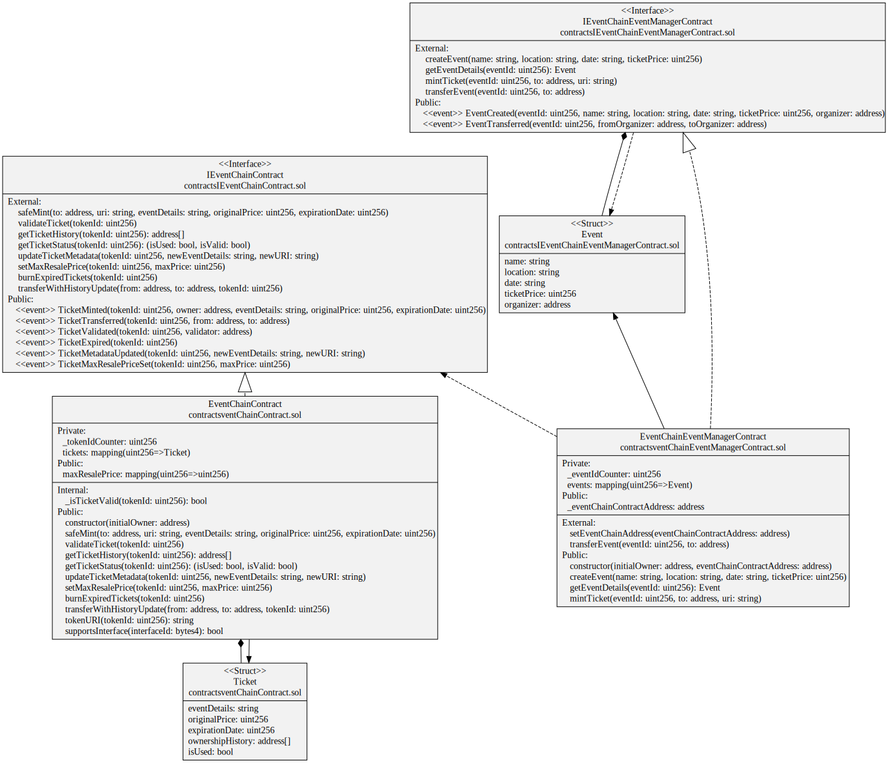
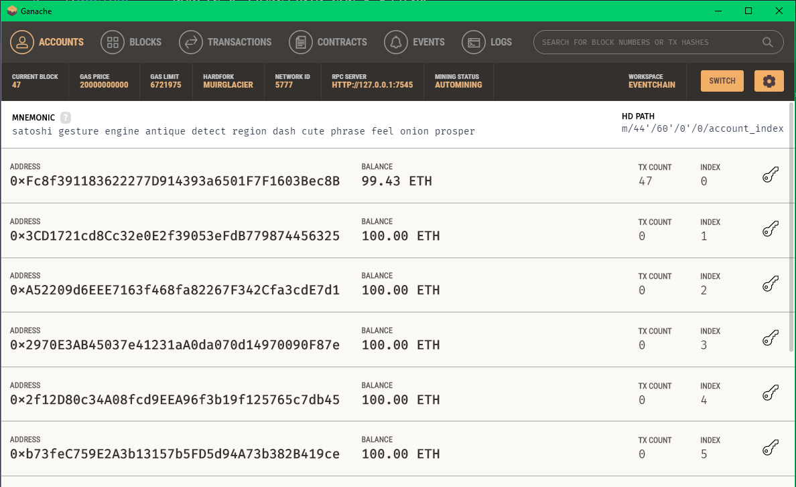

# 🎫 EventChain: Revolutionizing Ticketing with Blockchain Technology
Welcome to EventChain! This innovative project harnesses the transformative power of **blockchain technology** to address and resolve the persistent issues plaguing the event ticketing industry, including counterfeit tickets, ticket scalping, and lack of transparency.
In the traditional ticketing system, these problems have caused significant financial losses and frustration for both event organizers and attendees. By leveraging blockchain, EventChain aims to create a secure, transparent, and tamper-proof ticketing solution that benefits all stakeholders.

<p align="center">
  
  
  
  
  
  
</p>


## 🌟 Key Benefits of EventChain:
* 🔒 Secure and Tamper-Proof Tickets: Utilizes non-fungible tokens (NFTs) on the Polygon blockchain to represent tickets, ensuring they cannot be duplicated or counterfeited.
* 🕵️ Transparent Ownership and Traceability: Every transfer of a ticket is recorded on the blockchain, creating an immutable and auditable ownership history.
* ⏰ Expiration Control and Event Management: Organizers can set expiration dates for tickets, preventing their misuse after the event.
* 💸 Resale Regulation: Allows setting a maximum resale price for tickets to combat scalping.

## More Details 📝

For comprehensive information about this project, check out this [Medium article](https://sanchezsanchezsergio418.medium.com/eventchain-revolutionizing-ticketing-with-blockchain-technology-3ac39dbe20cb).

## UML Design Diagram
Complete UML diagram of decentralized application design.



## 🛠️ Installation
First, clone the repository:

```bash
git clone https://github.com/sergio11/eventchain_blockchain.git
cd eventchain_blockchain
```

Install the necessary dependencies:

```bash
npm install
```

## 💼 Smart Contracts

### 🎟️ EventChainContract
The **EventChainContract** is a cornerstone of the EventChain ticketing ecosystem. It is designed to manage the entire lifecycle of event tickets on the blockchain. This contract leverages the robustness of **Ethereum's ERC721** standard to ensure each ticket is unique, secure, and traceable. Key functionalities include minting new tickets, validating ticket authenticity, updating ticket metadata, and handling resale regulations, all while maintaining an immutable record of ownership history. This ensures a transparent, tamper-proof, and fair ticketing process for both event organizers and attendees.

```solidity
// SPDX-License-Identifier: MIT
pragma solidity ^0.8.9;

import "@openzeppelin/contracts/token/ERC721/ERC721.sol";
import "@openzeppelin/contracts/token/ERC721/extensions/ERC721Burnable.sol";
import "@openzeppelin/contracts/token/ERC721/extensions/ERC721URIStorage.sol";
import "@openzeppelin/contracts/access/Ownable.sol";
import "./IEventChainContract.sol";

contract EventChainContract is ERC721, ERC721URIStorage, ERC721Burnable, Ownable, IEventChainContract {
    // Contract implementation
}

```

#### 🔑 Key Functions
* **safeMint:** 🎟️ Mints a new ticket with specified details such as event information, original price, and expiration date. This function ensures the creation of a unique non-fungible token (NFT) representing the ticket on the blockchain.
* **validateTicket:** 🎫 Validates a ticket at the event by marking it as used, preventing multiple uses. This function verifies if the ticket is still within its validity period.
* **getTicketHistory:** 📜 Retrieves the ownership history of a ticket, providing transparency and traceability of ownership changes over time. This history is recorded on the blockchain and is immutable.
* **getTicketStatus:** 🕵️‍♂️ Checks if a ticket is used and still valid, indicating whether it has been used before and if it is still within its validity period.
* **updateTicketMetadata:** 🔄 Updates the metadata of a ticket, allowing modifications to event details associated with the ticket, such as event name, location, or date.
* **setMaxResalePrice:** 💰 Sets a maximum resale price for a ticket, helping organizers regulate ticket resale and prevent scalping.
* **burnExpiredTickets:** 🔥 Burns tickets that have expired, removing them from the system to free up resources and ensure efficient management of ticket inventory.

### 🎟️ EventChainEventManagerContract
The **EventChainEventManagerContract** is the backbone of the EventChain ecosystem, enabling seamless event management, ticket minting, and event transfer functionalities. It empowers organizers to create, manage, and transfer events securely and transparently on the blockchain, ensuring a smooth and reliable ticketing process from start to finish.

```solidity
// SPDX-License-Identifier: MIT
pragma solidity ^0.8.9;

import "./IEventChainContract.sol";
import "./IEventChainEventManagerContract.sol";
import "@openzeppelin/contracts/access/Ownable.sol";

contract EventChainEventManagerContract is Ownable, IEventChainEventManagerContract {
    // Contract implementation
}

```

#### 🔑 Key Functions
* **setEventChainAddress:** 🎟️ Sets the address of the EventChainContract, enabling communication between the EventChainEventManagerContract and the EventChainContract.
* **createEvent:** 📅 Creates a new event with specified details such as name, location, date, and ticket price. This function allows event organizers to set up events on the platform.
* **getEventDetails:** 📋 Retrieves the details of a specific event, providing information such as event name, location, date, and ticket price.
* **mintTicket:** 💳 Mints a new ticket for a specific event, allowing event organizers to issue tickets to attendees.
* **transferEvent:** 🔄 Transfers the ownership of an event to another organizer, enabling event management by different entities over time.

## 🚀 Usage

### 📜 Deploying Contracts
Deploying the EventChain smart contracts is a straightforward process using **Hardhat Ignition***. This tool simplifies the deployment process, allowing you to deploy your contracts with ease and confidence. Below is a step-by-step guide to deploying the EventChain contracts to your specified network.

Use the following command to deploy the contracts to the specified network (in this case, Polygon amoy):

```shell
npx hardhat ignition deploy ignition/modules/EventChain.js --network amoy   
```

```shell
√ Confirm deploy to network amoy (80002)? ... yes
Hardhat Ignition 🚀

Deploying [ EventChain ]

Batch #1
  Executed EventChain#EventChainContract

Batch #2
  Executed EventChain#EventChainEventManagerContract

[ EventChain ] successfully deployed 🚀

Deployed Addresses

EventChain#EventChainContract - 0xd4bC2d72a3f04ad194130ADcC35E9592a2a1761B
EventChain#EventChainEventManagerContract - 0xbaCAfEeEA7F14dE0cD8A1462C0136E429b323345
```

#### Post-Deployment Steps
* **Verify Contracts:** Use a block explorer (e.g., Etherscan) to verify your contracts are deployed correctly and to explore the contract's details.
* **Interact with Contracts:** Utilize the provided addresses to interact with your deployed contracts via a web interface or directly through scripts and tools like Hardhat or web3.js.
* **Set Up Event Management:** Use the deployed **EventChainEventManagerContract** to set up and manage events, mint tickets, and more.

Deploying your EventChain contracts with Hardhat Ignition ensures a smooth, efficient, and error-free process, paving the way for a robust and transparent event ticketing system.

## 🧪 Testing
Testing is a critical part of the development process for ensuring that our smart contracts function correctly and securely. The EventChain project includes comprehensive test suites for both the EventChainContract and the EventChainEventManagerContract. These tests cover a wide range of scenarios to ensure robustness and reliability.

### Running the Tests
To run the tests, use the following command:

```shell
npx hardhat test
```

This command will execute all the test scripts located in the test directory, and you should see output similar to the following:

```shell
  EventChainContract
    ✔ Should set the right owner (4323ms)
    ✔ Should mint a ticket (115ms)
    ✔ Should validate a ticket (134ms)
    ✔ Should fail to validate an already used ticket (177ms)
    ✔ Should fail to validate an expired ticket (92ms)
    ✔ Should update ticket metadata (110ms)
    ✔ Should not allow non-owner to update ticket metadata (97ms)
    ✔ Should set max resale price (73ms)
    ✔ Should not allow non-owner to set max resale price (63ms)
    ✔ Should burn expired tickets (106ms)
    ✔ Should not allow burning of valid tickets (60ms)
    ✔ Should transfer ticket with history update (61ms)
    ✔ Should not allow non-owner to transfer ticket (54ms)

  EventChainEventManagerContract
    ✔ Should set the right owner (83ms)
    ✔ Should set the event chain address (66ms)
    ✔ Should create an event (112ms)
    ✔ Should mint a ticket (82ms)
    ✔ Should transfer an event (79ms)
    ✔ Should not allow non-owner to transfer an event (82ms)
    ✔ Should not allow minting a ticket for non-existent event (88ms)
    ✔ Should not allow minting a ticket by non-organizer (85ms)
    ✔ Should not allow accessing non-existent event details (79ms)


  22 passing (6s)
```

You can also use ganache to carry out the tests, for this it is only necessary to use the network option

```shell
npx hardhat --network ganache test
```



Tests provide comprehensive coverage of all smart contract functionalities. They validate critical operations such as ticket creation, transfer, validation, and metadata updates. This thorough testing helps ensure that the EventChain platform is secure, reliable, and ready for deployment in real-world scenarios.


## Visitors Count


## Please Share & Star the repository to keep me motivated.
  <a href = "https://github.com/sergio11/eventchain_blockchain/stargazers">
     
  </a>
  <a href = "https://twitter.com/SergioReact418">
     
  </a>

